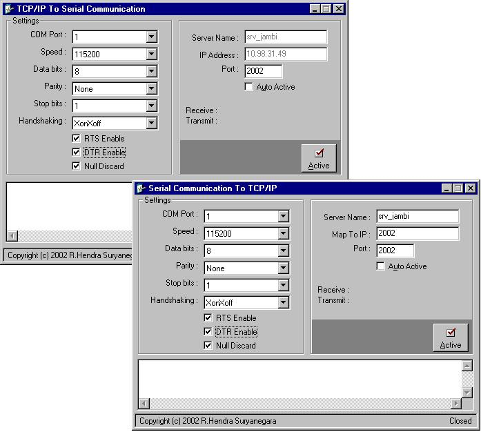



## Complete TCP To Serial & Serial To TCP

### Description

TCP/IP To Serial Communication, TCP/IP To Serial Communication With Multiple Connection, Serial Communication To TCP/IP.

Please vote!!!
 
### More Info
 

             |
---                |---
**Submitted On**   |2002-10-07 03:47:34
**By**             |[Hendra](https://github.com/Planet-Source-Code/PSCIndex/blob/master/ByAuthor/hendra.md)
**Level**          |Advanced
**User Rating**    |4.7 (104 globes from 22 users)
**Compatibility**  |VB 6\.0
**Category**       |[Miscellaneous](https://github.com/Planet-Source-Code/PSCIndex/blob/master/ByCategory/miscellaneous__1-1.md)
**World**          |[Visual Basic](https://github.com/Planet-Source-Code/PSCIndex/blob/master/ByWorld/visual-basic.md)
**Archive File**   |[Complete\_T14950311102002\.zip](https://github.com/Planet-Source-Code/hendra-complete-tcp-to-serial-serial-to-tcp__1-40588/archive/master.zip)

